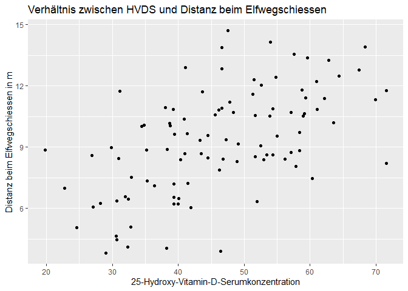

# **Musterlösungen für die Orkylade 2022**

Hier ist eine Musterlösungen für die sportwissenschaftliche Auswertung
der Orkylade 2022. Ich folge hier dem Styleguide aus dem Buch [Advanced
R](http://adv-r.had.co.nz/Style.html) von Hadley Wickham. Das Skript
beginnt mit einem kleinem Codchunk zum Setup. Dann werden die Daten
eingelesen und überprüft.

    # Pakete einlesen
    library(car) # Levene-Test
    library(knitr) # schöne Tabellen
    library(tidyverse) # beinhaltet verschiedene Pakte: z. B. dplyr und ggplot2
    # Default Chunk-Option festlegen
    opts_chunk$set(echo = TRUE)

    # Daten einlesen
    orks <- read.csv("Daten_Orks_Schiesberg_Sara.csv")
    # Datentypen überprüfen
    for(colum in names(orks)){
      print(paste(colum, ": ", class(orks[[colum]])))
    }

    ## [1] "id :  integer"
    ## [1] "name :  character"
    ## [1] "clan :  character"
    ## [1] "geschlecht :  character"
    ## [1] "kannibalismus :  character"
    ## [1] "krummbeinigkeit :  character"
    ## [1] "HVDS :  numeric"
    ## [1] "koerperhoehe_cm :  numeric"
    ## [1] "elfwegschiessen_m :  numeric"
    ## [1] "zwergenweitwurf_m :  numeric"

    # Korrektur der Datentypen
    # Für die nominalen Variablen: von character zu factor
    for(colum in c("clan", "geschlecht", "krummbeinigkeit")){
     orks[[colum]] <- factor(orks[[colum]])
    }
    # Für die ordinale Variable: von character zu ordered factor
    orks$kannibalismus <- factor(orks$kannibalismus, ordered = TRUE, 
                                 levels = c("noch nie", "selten", "oft", "sehr oft"))

# Aufgabe 1

**Auf der letzten Fachtagung haben Sie einen interessanten Vortrag
gehört: „Der Ork im Hier und Jetzt: Das Ende des bipolaren
Geschlechtermodells“. Nun möchten Sie sich gerne anschauen, ob auch die
Teilnehmer an der Orkylade einem progressiven Rollenmodel folgen.**  
**- Visualisieren Sie die Anzahl der Orks pro Geschlechtskategorie.**

Die Anzahl der Orks pro Geschlechtskategorie repräsentiert einen
metrische Angabe zu einer nominalen Merkmalsausprägung. Eine
Standardvisualsierung für solche Datenkonstellationen stellt das
Säulendiagramm dar.

    # Säulendiagramm
    ggplot(data = orks, aes(x = geschlecht, fill = geschlecht)) +
      geom_bar() +  
      labs(y = "Anzahl",                                                     
           x = "Geschlecht",
           title = "Geschlechterverteilung bei der Orkylade") +
      theme(legend.position="none") # Legende ausblenden

Männliche und weibliche Orks sind mit je 30 Individuen vertreten. Die
Anzahl der diversen Orks ist mit 40 Teilnehmern noch höher.

# Aufgabe 2

**Während Sie die Orkylade beobachteten, gewannen Sie den Eindruck, dass
sich die Clans im Hinblick auf die Körperhöhen unterscheiden.**  
**- Visualisieren Sie die Daten und geben Sie eine Vermutung ab!**  
**- Testen Sie: Bestätigt sich Ihre Vermutung?**

Da man hier die Ausprägung einer metrischen Variable in verschiedene
Kategorien vergleichen möchte, ist das Boxplot eine angemessene
Visualsierung.

    # Boxplot
    ggplot(data = orks, aes(x = clan, y = koerperhoehe_cm, fill = clan)) +
      geom_boxplot() +     
      labs(x ="Clan",                               
           y ="Größe in cm",
           title = "Körperhöhen der Clans") +
      theme(legend.position="none") # Legende ausblenden

Das Boxplot zeigt die Stichprobe der Orkyladeteilnehmer. In dieser
Stichprobe sind die Goffs am kleinsten, gefolgt von den Snakebites. Am
größten sind die Evil Sunz. Es ist besonders aufällig, dass sich die
Spannbreiten für die drei Clans nicht überlappen. Ich vermute, dass es
sich hier um Größenunterschiede handelt, die auch in der Grundgesamtheit
aller Clanmitglieder gelten.  
Um ein geeignetes Testverfahren auszuwählen, gilt es vorab zu klären, ob
die Daten normalverteilt sind. Das Boxplot zeigt im oberen Bereich des
Wertespektrums Aussreisser und die Whisker sind dort länger als bei den
jeweils kleineren Werten. Das sind Anzeichen für rechtsschiefe
Verteilungen. Für eine Überprüfung der Normalervteilungshyposthese wähle
ich den Shapiro-Wilks Test aus.

    # Shapiro-Wilks-Test
    # Vektor mit den Merkmalsausprägungen der kategorialen Variable
    clans <- unique(orks$clan)
    # Nun kann man über diese Merkmalsausprägungen iterieren
    for (clan in clans){
      clan_koerp <- filter(orks, clan == clan)
      test <- shapiro.test(clan_koerp$koerperhoehe)
             test$data.name <- paste("Körperhöhen für den Clan", clan) # Variablennamen für den output umbenennen
      print(test)
    } 

    ## 
    ##  Shapiro-Wilk normality test
    ## 
    ## data:  Körperhöhen für den Clan Snakebites
    ## W = 0.93179, p-value = 6.295e-05
    ## 
    ## 
    ##  Shapiro-Wilk normality test
    ## 
    ## data:  Körperhöhen für den Clan Goffs
    ## W = 0.93179, p-value = 6.295e-05
    ## 
    ## 
    ##  Shapiro-Wilk normality test
    ## 
    ## data:  Körperhöhen für den Clan Evil Sunz
    ## W = 0.93179, p-value = 6.295e-05

Bei dem Shapiro-Wilks-Test besteht die Nullhypothese in der Annahme,
dass es keinen Unterschied zu einer Normalverteilung gibt. Da die
p-Werte hier immer kleiner sind als 0.05 handelt es sich um
**signifiankte** Ergebnisse. Auf Grund dieser Ergebnisse ist die
Nullhypothese abzulehnen. Daher wähle ich hier ein parameterfreies
Verfahren aus, um die beobachteten Größenunterschiede auf Signifikanz zu
prüfen. Da es sich hier um eine unababhängige Stichprobe mit mehr als 2
kategorialen Merkmalsausprägungen handelt, ist die
Kruskal-Wallis-Rangvarianzanalyse angemessen.

    # Die Kruskal-Wallis Rangvarianzanalyse
    kruskal.test(koerperhoehe_cm ~ clan, data = orks)

    ## 
    ##  Kruskal-Wallis rank sum test
    ## 
    ## data:  koerperhoehe_cm by clan
    ## Kruskal-Wallis chi-squared = 87.512, df = 2, p-value < 2.2e-16

Bei der Kruskal-Wallis-Rangvarianzanalyse besteht die Nullhypothese in
der Annahme, dass es keine relevanten Unterschiede in der
Grundgesamtheit gibt. Da das Ergebnis hier mit p &lt; 0,01
**höchstsignifikant** ausfällt verwerfe ich die Nullhypothese und nehme
die Alternativhypothese von unterschiedlich großen Clanmitgliedern in
der Grundgesamtheit an.

# Aufgabe 3

**Könnte die Krummbeinigkeit von der Clanzugehörigkeit abhängen?**  
**- Testen Sie! Falls es es einen Zusammenhang gibt, wie stark ist
dieser?**

Da es sich sowohl bei Krummbeinigkeit als auch bei der Clanzugehörigkeit
um ein nominales Merkmale handelt, wird hier ein Chi-Quadrat-Test
durchgeführt.

    # Chi-Quadrat-Test
    chisq.test(orks$krummbeinigkeit, orks$clan)

    ## 
    ##  Pearson's Chi-squared test
    ## 
    ## data:  orks$krummbeinigkeit and orks$clan
    ## X-squared = 1.4932, df = 4, p-value = 0.8278

Bei dem Chi-Quadrat Test besagt die Nullhypothese, dass die beiden
Variablen unabhängig voneinander sind. Da p hier größer als 0,05 ist
behalte ich die Nullhypothese bei. Gemäß der Aufgabenstellung besteht
nun keine Notwendigkeit mehr, die Stärke des Zusammenhanges zu
ermitteln.

# Aufgabe 4

**Sie erinnern sich, dass Krummbeinigkeit ja auch eine Folge von
Vitamin-D-Mangel sein kann. Bekanntermaßen ist Vitamin-D-Mangel in
Orkpopulationen ein gravierendes Problem, weil Orks in Ihren Höhlen zu
wenig Sonnenlicht abbekommen. Ein Glück haben Sie die
25-Hydroxy-Vitamin-D Serumkonzentration im Blut aufgenommen! Vielleicht
hängt der sportliche Erfolg eines Orks ja von dem Vitamin-D-Mangel ab.
Sie entschließen sich den Zusammenhang zwischen der
25-Hydroxy-Vitamin-D-Serumkonzentration und dem Erfolg im
Elfwegschiessen eingehender zu untersuchen.**  
**- Wählen Sie zuerst eine Visualisierungsmethode und testen Sie dann
durch ein geeignetes Verfahren, ob es einen Zusammenhang gibt. Bestätigt
sich Ihre Vermutung?**

Sowohl bei der Distanz beim Elfwegschiessen als auch bei der
25-Hydroxy-Vitamin-D-Serumkonzentration handelt es sich um metrische
Variablen. Ein Streudiagramm ist geeignet um das Verhältnis zwischen
diesen Merkmalen zu betrachten.

    # Streudiagramm
    ggplot(data = orks, aes(x = HVDS, y = elfwegschiessen_m)) +
      geom_point() +  
      labs(x =  "25-Hydroxy-Vitamin-D-Serumkonzentration",                            
           y = "Distanz beim Elfwegschiessen in m",
           title = "Verhältnis zwischen HVDS und Distanz beim Elfwegschiessen") 

In dem Streudiagramm ist zu erkennen, dass je höher die
25-Hydroxy-Vitamin-D-Serumkonzentration im Blut ist, desto größer ist
auch der Erfolg beim Elfwegschießen. Ich vermute hier also einen
positiven Zusammenhang. Diese Vermutung soll durch ein geeignetes
Verfahren überprüft werden. Für die Methodenauswahl, möchte ich vorab
wissen, ob die Daten normalverteilt sind. Zu diesem Zweck werden die
Daten als densityplot visualisiert und durch einen Shapiro-Wilks-Test
überprüft.

    # In einem ersten Schritt lege ich einen neuen dataframe an. Dieser enthält die Beschriftung der x-Achse sowie den Diagrammtitel.  
    df <- data.frame(HVDS = c("25-Hydroxy-Vitamin-DSerumkonzentration", "Densityplot der HVDS-Werte"), 
      elfwegschiessen_m = c("Elfwegschiessen (m)", "Densityplot der beim Elfwegschießen erzielten Distanzen"))
    # Nun kann ich mir einiges an Code sparen, indem ich einfach über die beiden Variablen aus dem neuen Datafrane iteriere 
    for (var in names(df)){
      print(ggplot(data = orks, aes(x = orks[, var])) +
               geom_density() + 
               labs(x = df[1, var],
                    y = "Dichtewert",
                    title = df[2, var]))
             test <- shapiro.test(orks[[var]])
             test$data.name <- var # Variablennamen für den output umbenannen
             print(test)
             }

    ## 
    ##  Shapiro-Wilk normality test
    ## 
    ## data:  HVDS
    ## W = 0.98598, p-value = 0.3725

    ## 
    ##  Shapiro-Wilk normality test
    ## 
    ## data:  elfwegschiessen_m
    ## W = 0.98571, p-value = 0.3569

Im Ergebnis ist p sowohl für die Variable des Elfwegschießens als auch
für die HVDS-Werte größer als 0,05. Dementsprechend behalte ich hier die
Nullhypothese bei. Daher gehe ich nun davon aus, dass die beiden
metrischen Variablen normalverteilt sind. Somit kann man für diese
Analyse sehr gut Pearsons r einsetzten.

    # Pearsons r 
    cor.test(orks$elfwegschiessen_m, orks$HVDS, method = "pearson", alternative = "two.sided")

    ## 
    ##  Pearson's product-moment correlation
    ## 
    ## data:  orks$elfwegschiessen_m and orks$HVDS
    ## t = 6.7359, df = 98, p-value = 1.12e-09
    ## alternative hypothesis: true correlation is not equal to 0
    ## 95 percent confidence interval:
    ##  0.4116186 0.6834538
    ## sample estimates:
    ##       cor 
    ## 0.5625545

Pearsons r zeigt mit 0,56 einen mittelstarken Zusammenhanges auf. Dieser
Zusammenhang ist mit p &lt; 0,01 **höchstsignifikant**.

# Aufgabe 5

**Die unterschiedlichen HVDS-Werte der Orks lassen Ihnen keine Ruhe.
Sind einige Orks tatsächlich öfter in der Sonne als andere oder gleichen
die Höhlenbewohner ihr Defizit über die Nahrung aus? Ihnen kommt ein
schrecklicher Verdacht….**  
**- Visualisieren Sie die HVDS-Werte, differenziert nach der
Kannibalismuserfahrung der Orks.**  
**- Überprüfen Sie die Hypothese, dass sich die HVDS-Werte der
unterschiedlichen Kannibalismus-Kategorien unterscheiden. Wählen Sie ein
angemessenes Testverfahren aus!**

Auch hier ist die Ausprägung einer metrischen Variablen pro Kategorie
von Interesse. Deswegen kann man hier erneut ein Boxplot einsetzen.

    # Boxplot
    ggplot(data = orks, aes(x = kannibalismus, y = HVDS, fill = kannibalismus)) + 
      geom_boxplot() +
      labs(x ="Kannibalismuserfahrung",                           
           y ="25-Hydroxy-Vitamin-D-Serumkonzentration",
           title = "HVDS-Werte nach Kannibalismuserfahrung") +
        theme(legend.position="none") # Legende ausblenden

Das Boxplot zeigt sehr deutlich, dass die
25-Hydroxy-Vitamin-D-Serumkonzentration im Blut mit zunehmender
Kannibalsimuserfahrung ansteigt. Um die weitere Vorgehensweise zu
entscheiden, werden auch diese Daten auf Normalverteilung geprüft.
Zusätzlich wird hier auch der Levene-Test durchgeführt, der die
Homogenität der Varianzen prüft.

    # Überprüfung der Normalverteilung
    # Vektor mit den Merkmalsausprägungen der kategorialen Variable
    kanni <- unique(orks$kannibalismus)
    # Nun kann man über diese Merkmalsauspräungen iterieren
    for (k in kanni){
      hvds_kanni <- filter(orks, kannibalismus == k)
      print(ggplot(data = hvds_kanni, aes(x = HVDS)) +
              geom_density() +
              labs(x = "25-Hydroxy-Vitamin-D-Serumkonzentration",
                   y = "Dichtewert", 
                   title = paste("Densityplot der HVDS-Werte für die Kategorie", k)))
      test <- shapiro.test(hvds_kanni$HVDS)
      test$data.name <- paste("HVDS-Werte für die Kategorie", k)
    } 

    # Überprüfung der Varianzhomogenität 
    leveneTest(data = orks, HVDS ~ kannibalismus, na.rm = TRUE)

    ## Levene's Test for Homogeneity of Variance (center = median: TRUE)
    ##       Df F value Pr(>F)
    ## group  3  1.1493 0.3333
    ##       96

Es handelt sich hier um eine unabhängige Stichprobe mit metrischen Daten
in mehr als 2 Kategorien. Die metrische Variable ist normalverteilt und
erfüllt das Kriterium der Varianzhomogenität. Daher stellt die ANOVA
hier eine geeignete Methode dar, um die Datenserie auf Unterschiede zu
prüfen.

    # ANOVA
    res.aov <- aov(HVDS ~ kannibalismus, data = orks)
    summary(res.aov)

    ##               Df Sum Sq Mean Sq F value Pr(>F)    
    ## kannibalismus  3  11366    3789   139.1 <2e-16 ***
    ## Residuals     96   2614      27                   
    ## ---
    ## Signif. codes:  0 '***' 0.001 '**' 0.01 '*' 0.05 '.' 0.1 ' ' 1

Dem Ergebnis der ANOVA folgend, handelt es sich hier nicht um
zufallsbedingte Schwankungen. Anstelle dessen sind die Unterschiede
zwischen den Kategorien mit p &lt; **0,001** als höchstsignifikant zu
bewerten.

# Zusatzaufgabe bzw. „Knobelaufgabe“

**Bei jeder Orkylade stellt es ein Problem dar, dass die Orks so
schlechte Verlierer sind. In Anbetracht der hohen Todesraten unter den
Schiedsrichtern, möchte wirklich niemand einem Ork mitteilen, dass er
nicht der Gewinner ist. Am besten ist es wohl, wenn man die Vergleiche
unter den Orks einem Programm überlässt. Glauben Sie mir, dies wird
unsere Lebenserwartung steigern!**  
**Schreiben Sie eine Funktion. Diese nimmt die orks-Tabelle als input.
Die Funktion gibt eine neue Tabelle aus, welche das Verhältnis von
konkordanten zu diskonkordanten Paaren aufzeigt. Die Tabelle kann so
aufgebaut sein, wie das Beispiel von Folie 10 aus der
Korrelationspräsentation. Diese Tabelle hatte die Spalten:
Vergleichspaar, Zwergenweitwurf, Elfwegschiessen, Konkordant und
Diskonkordant.**  
**Vorüberlegung**: Ich habe mir für diese Aufgabe erst einmal eine
Matrix vorgestellt. In dieser werden die Orks einander in Spalten und
Zeilen gegenübergestellt. Als Beispiel beschränke ich mich hier erstmal
auf die ersten 5 orks.

    # Beispielmatrix 
    first_five <- orks$name[1:5]
    mtx <- matrix(rep("vgl.",each=5*5),
                  nrow = 5,
                  ncol = 5,
                  dimnames = list(first_five,
                                  c(first_five)))
    kable(mtx) # schöne Tabelle

<table>
<colgroup>
<col style="width: 19%" />
<col style="width: 15%" />
<col style="width: 15%" />
<col style="width: 19%" />
<col style="width: 13%" />
<col style="width: 16%" />
</colgroup>
<thead>
<tr class="header">
<th style="text-align: left;"></th>
<th style="text-align: left;">Dabub Shuoth</th>
<th style="text-align: left;">Spathu Traiz</th>
<th style="text-align: left;">Auhgan Gorzgdulg</th>
<th style="text-align: left;">Mol Olorzol</th>
<th style="text-align: left;">Kharag Bolulg</th>
</tr>
</thead>
<tbody>
<tr class="odd">
<td style="text-align: left;">Dabub Shuoth</td>
<td style="text-align: left;">vgl.</td>
<td style="text-align: left;">vgl.</td>
<td style="text-align: left;">vgl.</td>
<td style="text-align: left;">vgl.</td>
<td style="text-align: left;">vgl.</td>
</tr>
<tr class="even">
<td style="text-align: left;">Spathu Traiz</td>
<td style="text-align: left;">vgl.</td>
<td style="text-align: left;">vgl.</td>
<td style="text-align: left;">vgl.</td>
<td style="text-align: left;">vgl.</td>
<td style="text-align: left;">vgl.</td>
</tr>
<tr class="odd">
<td style="text-align: left;">Auhgan Gorzgdulg</td>
<td style="text-align: left;">vgl.</td>
<td style="text-align: left;">vgl.</td>
<td style="text-align: left;">vgl.</td>
<td style="text-align: left;">vgl.</td>
<td style="text-align: left;">vgl.</td>
</tr>
<tr class="even">
<td style="text-align: left;">Mol Olorzol</td>
<td style="text-align: left;">vgl.</td>
<td style="text-align: left;">vgl.</td>
<td style="text-align: left;">vgl.</td>
<td style="text-align: left;">vgl.</td>
<td style="text-align: left;">vgl.</td>
</tr>
<tr class="odd">
<td style="text-align: left;">Kharag Bolulg</td>
<td style="text-align: left;">vgl.</td>
<td style="text-align: left;">vgl.</td>
<td style="text-align: left;">vgl.</td>
<td style="text-align: left;">vgl.</td>
<td style="text-align: left;">vgl.</td>
</tr>
</tbody>
</table>

Diese Matrix hat nun viel zu viele Einträge. In der Diagonalen wird hier
beispielsweise jeder Ork sich selbst gegenübergestellt. Ich möchste aber
nicht jeden Ork mit sich selbst vergleichen! Blöd ist auch, dass die
Orks immer zweimal miteinder verglichen werden. So wird beispielsweise
Dabu Shouth sowohl in Zeile 1, Spalte 2 wie auch in Zeile 1, Spalte 1
mit Spathu Traiz verglichen. Um all diese ungewollten Vergleiche zu
eliminieren, ersetze ich die Einträge in der Hauptdiagonalen und in dem
darunter liegenden dreieckigen Bereich durch einen leeren String. Und
**et voilà** nun habe ich ein Schema nach dem ich meine Funktion
aufbauen kann.

    # Dreiecksmatrix
    mtx[lower.tri(mtx, diag = TRUE)] <- ""
    kable(mtx)

<table>
<colgroup>
<col style="width: 19%" />
<col style="width: 15%" />
<col style="width: 15%" />
<col style="width: 19%" />
<col style="width: 13%" />
<col style="width: 16%" />
</colgroup>
<thead>
<tr class="header">
<th style="text-align: left;"></th>
<th style="text-align: left;">Dabub Shuoth</th>
<th style="text-align: left;">Spathu Traiz</th>
<th style="text-align: left;">Auhgan Gorzgdulg</th>
<th style="text-align: left;">Mol Olorzol</th>
<th style="text-align: left;">Kharag Bolulg</th>
</tr>
</thead>
<tbody>
<tr class="odd">
<td style="text-align: left;">Dabub Shuoth</td>
<td style="text-align: left;"></td>
<td style="text-align: left;">vgl.</td>
<td style="text-align: left;">vgl.</td>
<td style="text-align: left;">vgl.</td>
<td style="text-align: left;">vgl.</td>
</tr>
<tr class="even">
<td style="text-align: left;">Spathu Traiz</td>
<td style="text-align: left;"></td>
<td style="text-align: left;"></td>
<td style="text-align: left;">vgl.</td>
<td style="text-align: left;">vgl.</td>
<td style="text-align: left;">vgl.</td>
</tr>
<tr class="odd">
<td style="text-align: left;">Auhgan Gorzgdulg</td>
<td style="text-align: left;"></td>
<td style="text-align: left;"></td>
<td style="text-align: left;"></td>
<td style="text-align: left;">vgl.</td>
<td style="text-align: left;">vgl.</td>
</tr>
<tr class="even">
<td style="text-align: left;">Mol Olorzol</td>
<td style="text-align: left;"></td>
<td style="text-align: left;"></td>
<td style="text-align: left;"></td>
<td style="text-align: left;"></td>
<td style="text-align: left;">vgl.</td>
</tr>
<tr class="odd">
<td style="text-align: left;">Kharag Bolulg</td>
<td style="text-align: left;"></td>
<td style="text-align: left;"></td>
<td style="text-align: left;"></td>
<td style="text-align: left;"></td>
<td style="text-align: left;"></td>
</tr>
</tbody>
</table>

Die Funktion basiert im Prinzip auf einer geschachtelten Schleife. Die
äußere Schleife iteriert über den ersten bis hin zum vorletzten Ork. Mit
jeder dieser Iterationen, wird die innere Schleife ausgeführt. Dabei
wird der entsprechende Ork mit den Orks vergleichen, die in der
Input-Tabelle folgen. Auf diese Art und Weise folge ich dem Schema aus
der oben gezeigten Dreiecksmatrix. Beispiel: mit der ersten Iteration
wird der Ork aus Zeile 1 mit den Orks aus Zeile 2-100 verglichen. Dann
wird der Ork aus Zeile 2 mit den Orks aus Zeile 3-100 vergleichen usw.
Die letzte Iteration vergleicht den Ork aus Zeile 99 mit dem Ork aus
Zeile 100.

    # Funktionsdefinition
    vgl_orks <- function(orkylade) {
      # Die Ergebnistabelle soll die folgenden Spalten haben: 
      Vergleichspaar <- c()
      Zwergenweitwurf <- c()
      Elfwegschießen <- c()
      Konkordant <- c()
      Diskonkordant <- c()
      # Der letzte und der vorletzte Ork haben die folgenden Zeilennummern:
      letz <-  nrow(orkylade) 
      voletz <- letz - 1 
      # Die geschachtelte Schleife
      for (i in 1:voletz) { # ab der 1 bis zur vorletzten Zeile
        for (j in (i + 1):letz){ # Ab der auf die i-te Zeile folgenden Zeile bis hin zur letzten Zeile.
          # Mit jeder Iteration werden nun Vergleiche zwischen dem Ork aus der i-ten und aus der j-ten Zeile durchgeführt
          # Definition von Vergleichsoperatoren in Abhängigkeit von dem Ergebnis des Vergleiches
          ifelse(orkylade[i, "zwergenweitwurf_m"] > orkylade[j, "zwergenweitwurf_m"], zeichen_zwerg <- ">", zeichen_zwerg <- "<")
          ifelse(orkylade[i, "elfwegschiessen_m"] > orkylade[j, "elfwegschiessen_m"], zeichen_elf <- ">", zeichen_elf <- "<")# Hier wird der
          # Definition von Konkordanz-Codes in Abhängigkeit von den Vergleichsoperatoren
          ifelse(zeichen_zwerg == zeichen_elf, kon <- 1, kon <- 0)
          ifelse(zeichen_zwerg != zeichen_elf, dis <- 1, dis <- 0)
          # Mit jeder Iteration wird den Vektoren ein Element hinzugefügt
          Vergleichspaar <- c(Vergleichspaar, paste(orkylade[i, "name"], "zu", orkylade[j, "name"])) 
          Zwergenweitwurf <- c(Zwergenweitwurf, paste(orkylade[i, "zwergenweitwurf_m"], zeichen_zwerg, orkylade[j, "zwergenweitwurf_m"])) 
          Elfwegschießen <- c(Elfwegschießen, paste(orkylade[i, "elfwegschiessen_m"], zeichen_elf, orkylade[j, "elfwegschiessen_m"]))
          Konkordant <- c(Konkordant, kon)
          Diskonkordant <- c(Diskonkordant, dis)
        }
        }
      #  Definition des Funktionsoutputs: Die als Dataframe zusammengebunden Vektoren
      orky_vgl <- data.frame(Vergleichspaar, Zwergenweitwurf, Elfwegschießen, Konkordant, Diskonkordant)
      return(orky_vgl)
    }

Soweit so gut, nun wende ich die Funktion an.

    # Anwendung der Funktion
    output <- vgl_orks(orks)
    kable(output [1:10,])

<table>
<colgroup>
<col style="width: 37%" />
<col style="width: 17%" />
<col style="width: 16%" />
<col style="width: 12%" />
<col style="width: 15%" />
</colgroup>
<thead>
<tr class="header">
<th style="text-align: left;">Vergleichspaar</th>
<th style="text-align: left;">Zwergenweitwurf</th>
<th style="text-align: left;">Elfwegschießen</th>
<th style="text-align: right;">Konkordant</th>
<th style="text-align: right;">Diskonkordant</th>
</tr>
</thead>
<tbody>
<tr class="odd">
<td style="text-align: left;">Dabub Shuoth zu Spathu Traiz</td>
<td style="text-align: left;">7.95 &lt; 8.19</td>
<td style="text-align: left;">10.17 &gt; 6.35</td>
<td style="text-align: right;">0</td>
<td style="text-align: right;">1</td>
</tr>
<tr class="even">
<td style="text-align: left;">Dabub Shuoth zu Auhgan Gorzgdulg</td>
<td style="text-align: left;">7.95 &lt; 24.47</td>
<td style="text-align: left;">10.17 &lt; 13.36</td>
<td style="text-align: right;">1</td>
<td style="text-align: right;">0</td>
</tr>
<tr class="odd">
<td style="text-align: left;">Dabub Shuoth zu Mol Olorzol</td>
<td style="text-align: left;">7.95 &gt; 5.88</td>
<td style="text-align: left;">10.17 &gt; 9.55</td>
<td style="text-align: right;">1</td>
<td style="text-align: right;">0</td>
</tr>
<tr class="even">
<td style="text-align: left;">Dabub Shuoth zu Kharag Bolulg</td>
<td style="text-align: left;">7.95 &lt; 14.86</td>
<td style="text-align: left;">10.17 &lt; 10.37</td>
<td style="text-align: right;">1</td>
<td style="text-align: right;">0</td>
</tr>
<tr class="odd">
<td style="text-align: left;">Dabub Shuoth zu Vukgilug Morggak</td>
<td style="text-align: left;">7.95 &lt; 14.04</td>
<td style="text-align: left;">10.17 &gt; 6.54</td>
<td style="text-align: right;">0</td>
<td style="text-align: right;">1</td>
</tr>
<tr class="even">
<td style="text-align: left;">Dabub Shuoth zu Ignorg Aglish</td>
<td style="text-align: left;">7.95 &lt; 10.87</td>
<td style="text-align: left;">10.17 &lt; 10.85</td>
<td style="text-align: right;">1</td>
<td style="text-align: right;">0</td>
</tr>
<tr class="odd">
<td style="text-align: left;">Dabub Shuoth zu Yulakgh Nayurn</td>
<td style="text-align: left;">7.95 &lt; 10.06</td>
<td style="text-align: left;">10.17 &gt; 8.39</td>
<td style="text-align: right;">0</td>
<td style="text-align: right;">1</td>
</tr>
<tr class="even">
<td style="text-align: left;">Dabub Shuoth zu Xoruk Ogdhnag</td>
<td style="text-align: left;">7.95 &lt; 19.13</td>
<td style="text-align: left;">10.17 &lt; 12.2</td>
<td style="text-align: right;">1</td>
<td style="text-align: right;">0</td>
</tr>
<tr class="odd">
<td style="text-align: left;">Dabub Shuoth zu Sinsbog Murzlam</td>
<td style="text-align: left;">7.95 &lt; 21.03</td>
<td style="text-align: left;">10.17 &gt; 7.87</td>
<td style="text-align: right;">0</td>
<td style="text-align: right;">1</td>
</tr>
<tr class="even">
<td style="text-align: left;">Dabub Shuoth zu Hibub Sharurz</td>
<td style="text-align: left;">7.95 &lt; 14.46</td>
<td style="text-align: left;">10.17 &gt; 8.43</td>
<td style="text-align: right;">0</td>
<td style="text-align: right;">1</td>
</tr>
</tbody>
</table>

Ok, das sieht ja erstmal ganz gut aus. Aber auch hier kann ein Test
nicht schaden!

    # Test
    # Dem Schema der Dreieckscksmatrix folgend, kann man die erwartete Anzahl an Paaren so berechnen: 
    anz_paare <- nrow(orks)*(nrow(orks)-1)/2
    anz_paare

    ## [1] 4950

    # Das kann man nun vergleichen mit der Anzahl an Reihen aus der Ergebnistabelle
    nrow(output)

    ## [1] 4950

    # Bis hierhin klappt ja alles. Kann man denn auch Kendalls Tau mit Hilfe der neuen Tabelle berechnen? 
    (sum(output$Konkordant)-sum(output$Diskonkordant))/anz_paare

    ## [1] 0.2812121

    # Das vergleichen wir nun mit dem Wert, den R uns ausgibt 
    cor(orks$elfwegschiessen_m, orks$zwergenweitwurf_m, method = "kendall")

    ## [1] 0.2819036

Bei Kendalls Tau gleichen sich die Ergebniss bis auf die dritte
Kommastelle. Das reicht mir :-)
